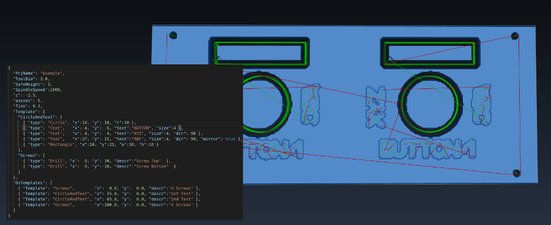

IMPORTANT: USE AT YOUR OWN RISK

Please learn a little bit G-Code to understand what you are doing: https://www.reprap.org/wiki/G-code
I.e. have a look at M3/M5/G2/G21/G92/G0/G1/G2/G3

# G-Code Tools for Node.JS

 

Required: Node.js https://nodejs.org/en/download/

All my tools expect a file name parameter and print out the result to stdout, so usage is typically

    ./toolXY.js inputFile > outputFile

Errors will apear on std-err, so you see them, and as comments in the output.

## [gcode-frontplate](./gcode-frontplate/)

Generates drills, holes and font engravings by s simple JSON input.

Features:
- Simple drill holes
- Circle and rectangle holes for a given center and dimensions.
  - define step count (loops) for given thickness
  - raw thru and fine cut
- Text engraving
  - size in mm
    - normal=outlined Arial font
    - small=single-line Arial font
  - letter pitch in mm 
  - rotation 
  - mirror
- repeat a defined structure template
- templates in templates

Stand alone, no anoying (npm) requiremens.

## [gcode-manipulate](gcode-manipulate/)

Some tool collection to read and re-arrange G-Code files:
- gCodeMoveX0Y0
  Solves the problem that some Inkscape plugins have problems to align the G-Code at (X=0/Y=0)
- gCodeScale
  scales X, Y, I, J values
- gCodeABC (warning, needs some G-Code editing in advance)
  Reads a G-Code file with an alphapet and generates JSON, as input for e.g. the "frontplate" designer.
  This is how I created the Arial fonts. 
  

# My Recommended Tools
* CAMotics (https://camotics.org/)
  to review the G-Code in 3d
* GRBL Controller (https://github.com/zapmaker/GrblHoming/releases)
  to send the G-Code to my "3018" 